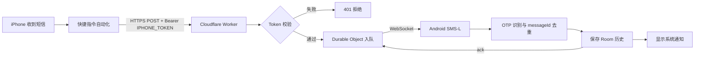

# SMS-L

SMS-L 是一个 Android 短信中继工具。它通过 iPhone「快捷指令自动化」接收转发的短信 JSON，在 Android 手机上显示系统通知、识别验证码，并保存最近的接收记录。

支持两种接收方式：

| 模式 | 链路 | iPhone 与 Android 需要在同一 Wi-Fi | 默认 |
| --- | --- | --- | --- |
| **Cloudflare 云端中继** | iPhone → HTTPS → Cloudflare Worker → Durable Object → WebSocket → Android | 否 | ✅ |
| 局域网直连（兼容保留） | iPhone → HTTP → Android 内嵌 HTTP 服务 | 是 | |

> 适用场景：主力手机使用 Android，但短信仍由 iPhone SIM 卡接收，希望把短信和验证码即时转发到 Android。

## 功能亮点

- **云端中继**：Android 主动连接 Cloudflare WebSocket，不需要公网 IP、不需要开放端口、不需要 VPS、不依赖第三方推送服务。
- **局域网直连**：保留原有实现，Cloudflare 不可用时可在设置中一键切回。
- **中文完整支持**：请求体与 JSON 全程严格使用 UTF-8，非法字节直接拒绝而不是替换成 `?`。
- **验证码识别**：从验证码、校验码、动态码、OTP、verification code 等关键词附近识别 4–8 位数字。
- **一键复制 OTP**：通知和消息历史均提供验证码复制操作。
- **本地消息历史**：使用 Room Database 保存最近 500 条记录，App 被关闭或手机重启后仍然保留。
- **不丢不重**：服务端短期队列 + WebSocket 重连补发保证不丢；Room 唯一索引幂等去重保证不重。
- **连接状态可见**：设置页实时显示已连接 / 连接中 / 重连中 / 认证失败及失败原因。
- **后台监听**：Android 前台服务持续维持连接，支持开机自动启动。
- **通知完全分离**：低打扰的前台服务通知与高优先级短信提醒使用独立 Channel 和 notificationId。
- **已读与角标同步**：点击短信通知、打开消息页或点击未读记录时，会明确取消对应短信提醒。
- **极简界面**：消息与设置两个一级页面，无账号体系、广告或复杂菜单。

## 工作流程



局域网模式下，Cloudflare 部分被替换为 Android 内嵌的 NanoHTTPD 服务，其余环节完全一致。

## 项目结构

```
SMS-L/
├── app/                        Android 客户端
│   └── src/main/java/com/localsmsrelay/
│       ├── CloudflareClient.kt     WebSocket 客户端（重连 / 心跳 / ack）
│       ├── RelayEnvelope.kt        云端协议解析与内容哈希兜底
│       ├── RelayEndpoint.kt        服务器地址规范化
│       ├── ConnectionState.kt      连接状态模型
│       ├── RelayService.kt         前台服务，承载两条互斥链路
│       ├── RelayHttpServer.kt      局域网模式：NanoHTTPD 服务
│       ├── IncomingMessage.kt      短信模型（两条链路共用）
│       ├── AppPrefs.kt             配置读写
│       ├── OtpExtractor.kt         验证码识别
│       ├── NotificationHelper.kt   通知
│       └── data/                   Room 数据库与仓库层
├── server/
│   └── cloudflare/             Cloudflare Worker + Durable Object
│       ├── src/index.js            Worker 路由、Token 校验、内容哈希兜底
│       ├── src/hub.js              Durable Object：连接管理与待确认队列
│       ├── wrangler.toml           部署配置
│       └── README.md               部署与故障排查
└── README.md
```

## 系统要求

- Android 8.0 及以上（`minSdk 26`）
- 云端模式：一个 Cloudflare 账号（免费计划即可）
- 局域网模式：iPhone 与 Android 位于可互访的同一 Wi-Fi，且 iPhone「快捷指令」具有本地网络权限

项目当前配置：

| 项目 | 版本 |
| --- | --- |
| App | 1.4.0 |
| minSdk | 26 |
| targetSdk / compileSdk | 36 |
| Room | 2.8.4 |
| OkHttp | 4.12.0 |
| NanoHTTPD | 2.3.1（局域网模式） |

## 快速开始（云端模式）

### 1. 部署 Cloudflare 侧

完整步骤见 [`server/cloudflare/README.md`](server/cloudflare/README.md)。要点：

```bash
cd server/cloudflare
npm install
npx wrangler login
npx wrangler secret put IPHONE_TOKEN    # 给 iPhone 用
npx wrangler secret put ANDROID_TOKEN   # 给 Android 用，必须与上面不同
npx wrangler deploy
```

部署后会得到形如 `https://sms-l-relay.<子域>.workers.dev` 的地址。

### 2. 配置 Android

1. 安装 APK 并打开 SMS-L。
2. 进入「设置」，确认「使用 Cloudflare 云端中继」已开启。
3. **服务器地址**填上一步得到的地址，`wss://` 和 `/ws` 会自动补全。
4. **Android Token** 复制下来，执行 `npx wrangler secret put ANDROID_TOKEN` 写入同一份值。
5. 点「保存配置」，再点「启动服务」。
6. 状态应变为 **已连接云端**。若显示认证失败，说明两边 Token 不一致。

### 3. 配置 iPhone 快捷指令

1. 打开「快捷指令」→「自动化」→ 新建「收到信息」个人自动化。
2. 选择「立即运行」或关闭运行前询问。
3. 添加「获取 URL 内容」。
4. URL 填 `https://sms-l-relay.<子域>.workers.dev/sms`。
5. 展开后设置：方法 `POST`，请求正文 `JSON`。
6. 添加请求头：

   ```text
   Content-Type: application/json
   Authorization: Bearer <IPHONE_TOKEN>
   ```

7. JSON 正文：

   ```json
   {
     "messageId": "唯一ID（可选）",
     "sender": "95588",
     "text": "您的验证码是123456",
     "timestamp": 1726680000
   }
   ```

| 字段 | 必填 | 说明 |
| --- | --- | --- |
| `text` | 是 | 短信完整正文 |
| `sender` | 否 | 发件人号码或名称 |
| `timestamp` | 否 | UNIX 秒 |
| `messageId` | 否 | 短信唯一标识；缺失时服务端用内容哈希兜底 |

## 验收测试

部署完成后，先用 curl 打通链路，再验证 Android 通知：

```bash
curl -i -X POST https://sms-l-relay.<子域>.workers.dev/sms \
  -H "Content-Type: application/json" \
  -H "Authorization: Bearer <IPHONE_TOKEN>" \
  -d '{"messageId":"test-001","sender":"95588","text":"您的验证码是123456","timestamp":1726680000}'
```

期望返回 `202` 与 `{"ok":true,"messageId":"test-001","delivered":1}`，同时 Android 弹出验证码通知。

其他场景：

| 测试 | 命令要点 | 期望 |
| --- | --- | --- |
| 鉴权 | 去掉 `Authorization` 头 | `401` |
| Token 隔离 | 用 `ANDROID_TOKEN` 调 `/sms` | `401` |
| 去重 | 同一条命令重复发送 | 返回 `202`，但只弹一次通知 |
| 断网补发 | 关闭 Android 网络 → 发送 → 恢复网络 | 重连后补发通知 |
| 超大正文 | `text` 超过 8000 字符 | `400` |

## 局域网模式（兼容保留）

在设置中关闭「使用 Cloudflare 云端中继」即切回原有实现，配置项与旧版一致：

1. 打开「设置」，复制自动生成的 Token。
2. 保持默认端口 `8765`，或设置 `1024–65535` 范围内的端口。
3. 记录页面显示的「iPhone 请求地址」，例如 `http://192.168.1.88:8765/sms`。
4. 快捷指令的 URL 填该地址，JSON 正文额外包含 `token` 字段：

   ```json
   {
     "sender": "95555",
     "text": "【招商银行】您的验证码为583921，5分钟内有效",
     "messageId": "message-abc123",
     "token": "粘贴 SMS-L 中显示的 Token"
   }
   ```

局域网模式的接口（`POST /sms`、`GET /health`）、状态码、去重与大小限制与旧版完全一致。

> 局域网模式是明文 HTTP，仅靠 Token 鉴权。请勿在公共或不可信 Wi-Fi 中使用。

## HTTP API（局域网模式）

| 状态码 | 含义 |
| --- | --- |
| `200` | 请求成功，或相同 `messageId` 已处理 |
| `400` | JSON、Content-Type 或字段无效 |
| `401` | Token 错误 |
| `404` | 接口不存在 |

限制：请求体最大 16 KiB，`text` 最大 8,000 字符。

## 可靠性与去重

两层机制配合，才能同时做到「不丢」和「不重」：

1. **不丢**：Worker 把消息写入 Durable Object 的待确认队列（上限 50 条、保留 24 小时）。Android 断线期间到达的消息留在队列里，重连后立即重放。
2. **不重**：Android 每成功写库就回发 `ack`，DO 收到即出队；即使 ack 丢失，重放的消息也会被 Room 上 `messageId` 的唯一索引拦下。

**messageId 兜底**：快捷指令若给不出唯一值，服务端用 `SHA-256(sender + NUL + text + NUL + timestamp秒)` 生成确定性 ID（前缀 `h1-`）。Android 端实现了完全相同的算法，并由单元测试锁定跨语言一致性。

> 权衡：兜底哈希下，「同一秒、同一发件人、完全相同正文」的两条短信会被判为重复。这是为了在快捷指令无法提供唯一 ID 时仍能去重而接受的代价。

## 后台运行

- WebSocket 长连接运行在 `RelayService` 前台服务中，通知类型固定为 `connectedDevice`（保留原有类型，不使用有 6 小时上限的 `dataSync`）。
- 网络切换时通过 `ConnectivityManager` 回调立即重连，不等退避计时。
- 断线后按指数退避重连（1s → 60s 上限，带 ±20% 抖动）。
- 开启「开机自动启动」后，`BootReceiver` 会在开机和 App 更新后恢复服务。

建议设置：

```text
设置 → 应用 → SMS-L → 电池 → 不受限制
```

设置页提供「打开电池设置」入口。Samsung One UI 等系统的省电策略仍可能中断后台服务，此时 SMS-L 会提示恢复。

> 由于不使用任何推送服务，如果 Android 进程被系统彻底杀死，消息只能在服务恢复后补发，**此时的延迟是不确定的**。这是放弃推送服务的必然代价。

## 隐私与安全

- 云端模式全程 HTTPS/WSS，Token 只通过 `Authorization` 请求头传递，不出现在 URL、日志或错误信息中。
- 两个 Token 完全独立：`IPHONE_TOKEN` 只存于 Worker Secrets，`ANDROID_TOKEN` 只存于 Worker Secrets 与手机本地。
- Worker 与 Durable Object **不输出任何包含短信正文、发件人或 Token 的日志**。
- Android 不暴露公网端口，连接由手机主动发起，因此不泄露手机真实 IP。
- 不上传短信或历史记录到任何第三方；Cloudflare 只做转发与短期排队。
- 不需要注册账号，不读取 Android 本机短信数据库。
- Debug 日志只记录解析后的短信正文，不记录 Token。

## Android 权限

| 权限 | 用途 |
| --- | --- |
| `INTERNET` | 建立 WSS 长连接；局域网模式下的本机监听 |
| `ACCESS_NETWORK_STATE` / `ACCESS_WIFI_STATE` | 网络变化感知；局域网模式下识别物理 Wi-Fi IPv4 |
| `CHANGE_NETWORK_STATE` | 满足 connectedDevice 前台服务运行条件，不主动修改网络 |
| `FOREGROUND_SERVICE` | 持续运行中继服务 |
| `POST_NOTIFICATIONS` | 显示短信和服务通知 |
| `RECEIVE_BOOT_COMPLETED` | 开机后按用户设置恢复服务 |

清单中保留了 `usesCleartextTraffic="true"`，因为兼容保留的局域网模式使用明文 HTTP。云端模式本身不需要它；若要彻底禁用明文，需同时移除局域网模式。

## 构建与测试

```powershell
.\gradlew.bat testDebugUnitTest assembleDebug
```

```powershell
adb install -r .\app\build\outputs\apk\debug\app-debug.apk
```

Cloudflare 侧：

```bash
cd server/cloudflare
npm run check    # JS 语法检查
npx wrangler dev # 本地开发
```

## 已知限制

- 云端模式依赖 Cloudflare 服务可用性；不可用时可在设置中切回局域网模式。
- 长时间离线后重连，最多补发最近 50 条、24 小时内的消息。
- Samsung One UI、省电模式或系统「强行停止」可能中断后台服务。
- SMS-L 只负责转发、通知和本地历史，不支持回复短信。
- 局域网模式要求 iPhone 与 Android 处于可互访的同一局域网，访客网络的客户端隔离会阻止请求。
- iOS 快捷指令可用的短信变量和自动运行行为可能随系统版本、地区或设备策略变化。

## 故障排查

| 现象 | 排查方向 |
| --- | --- |
| WebSocket 连不上 | 检查服务器地址是否可访问；确认填的是 Worker 地址而非 `/sms` 接口地址 |
| 状态显示认证失败 | Android Token 与 Worker 的 `ANDROID_TOKEN` secret 不一致 |
| 后台频繁断开 | 关闭该 App 的电池优化；确认未被系统「强行停止」 |
| Cloudflare 返回 401 | `Authorization` 头必须是 `Bearer <token>`，注意首尾空格 |
| 消息重复 | 确认 Android 能回发 ack；正常情况下 Room 唯一索引也会拦下 |
| 消息丢失 | 超过 50 条或 24 小时的离线消息不会补发；检查 App 是否在运行 |
| 重启后不自动连接 | 设置中开启「开机自动启动」，并关闭电池优化 |

## 验证状态

- UTF-8 中文短信测试
- OTP 识别测试
- 物理 Wi-Fi / VPN 排除测试
- 消息时间格式与 `messageId` 去重测试
- Room 数据库持久化、500 条上限、v1 → v2 → v3 迁移、唯一索引去重
- Cloudflare Worker 与 Durable Object 逻辑测试（67 项，`cd server/cloudflare && npm test`）
- 跨语言内容哈希一致性测试（Node 与 Kotlin 两端对照）
- `lintDebug` 与 `assembleDebug` 构建检查

每个 Release 页面会同时提供 APK 和对应的 SHA-256 校验文件。
