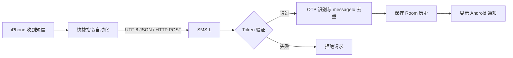

# SMS-L

SMS-L 是一个轻量、纯本地的 Android 短信中继工具。它通过 iPhone“快捷指令自动化”接收转发的短信 JSON，在 Android 手机上显示系统通知、识别验证码，并保存最近的接收记录。

整个过程只发生在局域网内，不依赖账号、云服务器、Firebase、Root 或互联网。

> 适用场景：主力手机使用 Android，但短信仍由 iPhone SIM 卡接收，希望在同一 Wi-Fi 下把短信和验证码即时转发到 Android。

## 功能亮点

- **局域网直连**：iPhone 通过 `POST /sms` 直接向 Android 发送短信，不经过第三方服务器。
- **中文完整支持**：HTTP 请求体和 JSON 全程严格使用 UTF-8，避免中文短信乱码。
- **验证码识别**：从验证码、校验码、动态码、OTP、verification code 等关键词附近识别 4–8 位数字。
- **一键复制 OTP**：通知和消息历史均提供验证码复制操作。
- **本地消息历史**：使用 Room Database 保存最近 500 条记录，App 被关闭或手机重启后仍然保留。
- **请求去重**：相同 `messageId` 在短时间内不会重复通知或重复写入历史。
- **Token 验证**：每个请求必须携带本机生成的随机 Token。
- **后台监听**：Android 前台服务持续接收请求，可选择开机自动启动。
- **VPN/TUN 兼容**：FlClash、VPN 或 TUN 开启时，页面仍显示真实物理 Wi-Fi IPv4。
- **极简界面**：消息与设置两个一级页面，无账号体系、广告或复杂菜单。

## 工作流程



## 系统要求

- Android 8.0 及以上（`minSdk 26`）
- iPhone 与 Android 位于可以互相访问的同一 Wi-Fi/LAN
- iPhone“快捷指令”具有本地网络访问权限
- Android 允许 SMS-L 显示通知

项目当前配置：

| 项目 | 版本 |
| --- | --- |
| App | 1.1.3 |
| minSdk | 26 |
| targetSdk / compileSdk | 36 |
| Room | 2.8.4 |
| NanoHTTPD | 2.3.1 |

## 安装

### 下载 APK

从仓库的 [Releases](../../releases) 页面下载最新 Debug APK，然后在 Android 手机上安装。

### 从源码构建

使用 Android Studio 打开项目，或在项目根目录执行：

```powershell
.\gradlew.bat testDebugUnitTest assembleDebug
```

生成文件：

```text
app/build/outputs/apk/debug/app-debug.apk
```

ADB 安装：

```powershell
adb install -r .\app\build\outputs\apk\debug\app-debug.apk
```

## Android 初次配置

1. 打开 **SMS-L**，默认进入“消息”页面。
2. 点击“启动”并允许通知权限。
3. 进入“设置”页面，复制自动生成的 Token。
4. 保持默认端口 `8765`，或设置 `1024–65535` 范围内的端口。
5. 记录页面显示的“iPhone 请求地址”，例如：

```text
http://192.168.1.88:8765/sms
```

Samsung One UI 建议设置：

```text
设置 → 应用 → SMS-L → 电池 → 不受限制
```

设置页提供“打开电池设置”入口。如果系统限制后台启动，SMS-L 会尽可能显示恢复服务提醒。

## 配置 iPhone 快捷指令

1. 打开“快捷指令” → “自动化”。
2. 新建“收到信息”个人自动化。
3. 选择“立即运行”或关闭运行前询问。
4. 添加“获取 URL 内容”。
5. URL 填写 SMS-L 设置页显示的 iPhone 请求地址。
6. 方法选择 `POST`。
7. 请求正文选择 `JSON`。
8. 至少添加 `text` 和 `token`。

Header：

```text
Content-Type: application/json
```

JSON 字段：

| 字段 | 必填 | 说明 |
| --- | --- | --- |
| `text` | 是 | 短信完整正文 |
| `token` | 是 | SMS-L 设置页显示的 Token |
| `sender` | 否 | 发件人号码或名称 |
| `timestamp` | 否 | iPhone 提供的时间；不用于 Android 接收时间 |
| `messageId` | 否 | 短信唯一标识，用于请求去重 |

请求示例：

```json
{
  "sender": "95555",
  "text": "【招商银行】您的验证码为583921，5分钟内有效",
  "messageId": "message-abc123",
  "token": "粘贴 SMS-L 中显示的 Token"
}
```

`messageId` 必须能够唯一标识一条短信。无法产生唯一值时应省略该字段，不要填写固定值。

## HTTP API

### `POST /sms`

接收短信 JSON。兼容：

```text
application/json
application/json; charset=utf-8
```

成功响应：

```json
{"ok":true}
```

常见状态码：

| 状态码 | 含义 |
| --- | --- |
| `200` | 请求成功，或相同 `messageId` 已处理 |
| `400` | JSON、Content-Type 或字段无效 |
| `401` | Token 错误 |
| `404` | 接口不存在 |

限制：请求体最大 16 KiB，`text` 最大 8,000 字符。

### `GET /health`

服务健康检查：

```json
{"ok":true,"service":"SMS-L"}
```

## 消息历史

每个通过 Token 验证且未被判定为重复的请求会保存：

- 发件人
- 短信正文
- 识别到的 OTP
- Android 手机实际接收时间
- `messageId`

消息按最新时间倒序显示，最多保留 500 条。超过上限后自动删除最旧记录。可在消息页面右上角菜单中清空全部历史。

数据库仅保存在 App 私有目录，不会写入 Samsung Messages。

## 网络与 VPN

- HTTP Server 底层使用通配地址监听，保证 VPN/TUN 切换时服务无需绑定虚拟 IP。
- 用户界面只显示通过 `ConnectivityManager` 获取的真实物理 Wi-Fi IPv4。
- 自动排除 VPN、TUN、蜂窝网络、loopback、link-local 和 IPv6 地址。
- Wi-Fi IP 变化后，设置页会自动刷新 iPhone 请求地址。

建议在路由器中为 Android 手机设置 DHCP 静态租约，避免 IP 经常变化。

## 隐私与安全

- 不上传短信或历史记录。
- 不需要注册账号。
- 不读取 Android 本机短信数据库。
- Token 使用安全随机数生成并保存在本机 `SharedPreferences`。
- Debug 日志只记录解析后的短信正文，不记录 Token。
- HTTP 为局域网明文传输，请勿在公共或不可信 Wi-Fi 中使用，也不要公开请求地址和 Token。

## Android 权限

| 权限 | 用途 |
| --- | --- |
| `INTERNET` | 在本机打开 HTTP 监听端口 |
| `ACCESS_NETWORK_STATE` / `ACCESS_WIFI_STATE` | 识别物理 Wi-Fi IPv4 |
| `CHANGE_NETWORK_STATE` | 满足 connectedDevice 前台服务运行条件，不主动修改网络 |
| `FOREGROUND_SERVICE` | 持续运行局域网监听服务 |
| `POST_NOTIFICATIONS` | 显示短信和服务通知 |
| `RECEIVE_BOOT_COMPLETED` | 开机后按用户设置恢复服务 |

## 已知限制

- iPhone 与 Android 必须处于可互访的同一局域网，访客网络的客户端隔离会阻止请求。
- Samsung One UI、省电模式或系统“强行停止”可能中断后台服务。
- SMS-L 只负责转发、通知和本地历史，不支持回复短信。
- `messageId` 去重记录保存在内存中，App 进程重启后会重新开始记录。
- iOS 快捷指令可用的短信变量和自动运行行为可能随系统版本、地区或设备策略变化。

## 验证状态

- UTF-8 中文短信测试
- OTP 识别测试
- 物理 Wi-Fi / VPN 排除测试
- 默认消息页与空状态测试
- 消息时间格式与 `messageId` 去重测试
- Room 数据库持久化、500 条上限与清空测试代码
- `lintDebug` 与 `assembleDebug` 构建检查

当前 Debug APK SHA-256：

```text
193261E21FAA963C2426D0D408885404463FB9F6EEDD3D185114B957F79F398C
```
